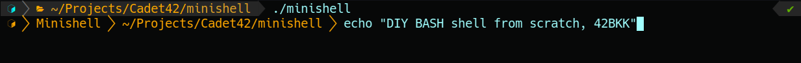

# Minishell 

Mini hell.. Uhhhh... I mean Minishell is the first 42's student (a.k.a. Cadets) group project to create a usable BASH-like clone in C98 with some limitations, and 42's code normination. The project's subject only allow the use of the given functions, syscalls, and your own implimentation of libc (a.k.a libft) from scratch.
